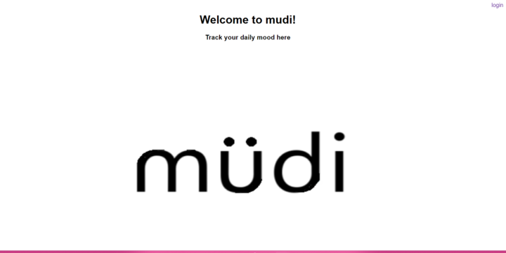
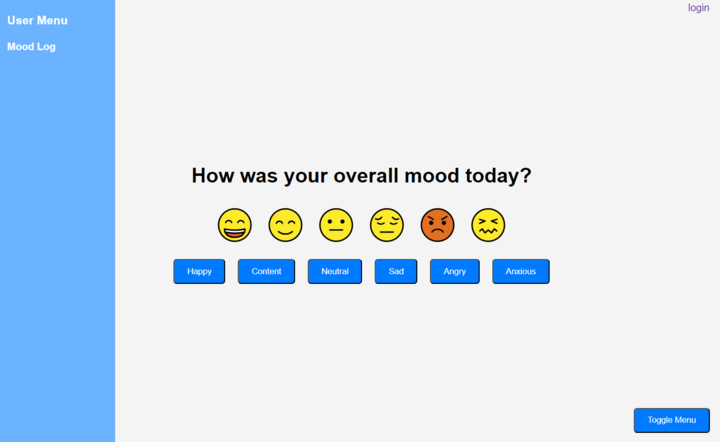

# mudi
## Description
With mudi, enter a mood every day to keep track of your wellness!
## Usage
### Website Link
https://mood-tracker-gp-a6fcbb48bcc3.herokuapp.com/

### Site Preview

## Sources
- [Openmoji](https://github.com/hfg-gmuend/openmoji/tree/15.0.0)
- [Express](https://expressjs.com/)
- [Express Handlebars](https://www.npmjs.com/package/express-handlebars)
- [Express Session](https://expressjs.com/en/resources/middleware/session.html)
- [MySQL2](https://sidorares.github.io/node-mysql2/docs)
- [Sequelize](https://sequelize.org/docs/v6/)
- [Connect Session Sequelize](https://www.npmjs.com/package/connect-session-sequelize)